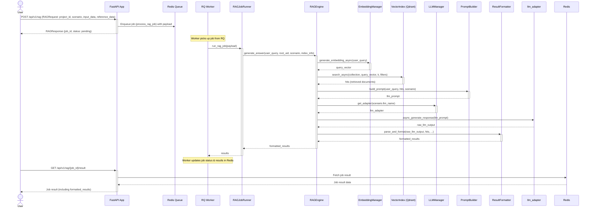

# rag-core-x

> **A production-ready Retrieval-Augmented Generation service** that **schedules**, **stores**, and **serves** document-aware intelligence through a robust set of Web APIs. Built to power multiple downstream products such as **Fraudlens** and **Relulens-AI** etc.

---

## Authors

* [Jerry Hung](https://github.com/JerryHung1030)
* [Ken Su](https://github.com/ken22i)
* [SJ](https://github.com/shih1999)

---

## Table of Contents

1. [✨ Features](#-features)
2. [🗺️ Architecture Overview](#-architecture-overview)
3. [🚀 Quick Start](#-quick-start)
4. [📂 Project Structure](#-project-structure)
5. [⚙️ Configuration](#-configuration)
6. [🛠️ API Usage](#-api-usage)
7. [🚧 Development Status & Roadmap](#-development-status--roadmap)
8. [🤝 Contributing](#-contributing)
9. [📄 License](#-license)

---

## ✨ Features

*   **End-to-End RAG Pipeline:** Powered by **OpenAI GPT-4o** (default) or a local **Llama** adapter.
*   **Flexible Data Ingestion:** Supports hierarchical JSON (`level1` → `level5`) with automatic flattening, optional chunk-splitting, and schema validation.
*   **Pluggable Embeddings:** Utilizes `langchain-openai` (defaults to `text-embedding-ada-002`) for text embeddings.
*   **Scalable Vector Storage:** Abstracted vector store built on **Qdrant**, supporting upsert, search with metadata filters, and asynchronous operations.
*   **Intelligent Prompt Engineering:** `PromptBuilder` dynamically fits queries and candidate documents within a configurable token budget, with graceful backoff mechanisms.
*   **Comprehensive Result Formatting:** `ResultFormatter` parses LLM JSON output, merges similarity scores, filters by confidence, and normalizes search direction (forward/reverse/both).
*   **Asynchronous Job Orchestration:** Leverages **Redis-RQ** for batch ingestion and RAG jobs, fronted by a minimal **FastAPI** layer.
*   **Rich Logging:** Implements **Loguru** for structured logging with daily rotation.

---

## 🗺️ Architecture Overview



---

## 🚀 Quick Start

The fastest way to get rag-core-x up and running is by using Docker Compose. This method handles the installation and launch of all necessary services, including Qdrant, Redis, and the API.

### Prerequisites

*   **Docker and Docker Compose:** Ensure Docker and Docker Compose are installed on your system.
    *   To install Docker, download the official script:
        ```bash
        curl -fsSL https://get.docker.com -o get-docker.sh
        sudo sh get-docker.sh
        ```
    *   Verify the installation:
        ```bash
        docker --version
        sudo docker run hello-world
        ```
        (Docker Compose is typically included with modern Docker installations.)

*   **OpenAI API Key:** Set your `OPENAI_API_KEY` environment variable. You can do this by creating a `.env` file in the project root:
    ```env
    OPENAI_API_KEY="your_openai_api_key_here"
    ```
    The application will not function correctly without this key.

### Launching Services

1.  **Clone the repository (if you haven't already):**
    ```bash
    git clone <repository_url>
    cd rag-core-x
    ```

2.  **Build and run with Docker Compose:**
    ```bash
    docker compose up --build -d
    ```
    The `-d` flag runs the services in detached mode.

The API will be available at `http://localhost:8000` by default. You can check the logs using `docker compose logs -f`.

---

## 📂 Project Structure

The project is organized into several key directories:

```text
rag-core-x/
├── .github/                    # GitHub Actions workflows (e.g., CI)
├── docs/                       # Documentation, API specifications (e.g., RAGCore-X_api.xlsx)
├── src/                        # Python source root
│   ├── config/                 # Configuration: YAML files and Pydantic settings
│   ├── data/                   # Example datasets (e.g., demo JSON files)
│   ├── interfaces/             # Entry layer: API, CLI, Job Runner
│   │   ├── api/                #   • FastAPI web application and endpoints
│   │   ├── jobs/               #   • Redis-RQ job execution logic
│   │   └── cli_main.py         #   • Command-line interface entry point
│   ├── rag_core/               # Core RAG logic: Domain, Application, Infrastructure
│   │   ├── application/        #   • Use-cases: RAGEngine, PromptBuilder, ResultFormatter
│   │   ├── domain/             #   • Business objects, Pydantic models, and enums
│   │   ├── infrastructure/     #   • Adapters: Embeddings, VectorStore, LLM providers
│   │   └── utils/              #   • Shared utilities (token counter, blacklist, etc.)
│   └── utils/                  # General utility modules (e.g., logging setup)
│
├── tests/                      # PyTest suites (unit, integration tests)
│   └── …                       #   • Grouped by layer: application, domain, infrastructure, interfaces
│
├── .gitignore                  # Specifies intentionally untracked files that Git should ignore
├── docker-compose.yml          # Defines and configures multi-container Docker applications
├── Dockerfile                  # Instructions for building the Docker image for the application
├── LICENSE                     # Project license information
├── README.md                   # This document
├── requirements.txt            # Python package dependencies
└── setup.py                    # Script for packaging and distributing the project
```

---

## ⚙️ Configuration

rag-core-x employs a layered configuration system, prioritizing settings as follows:

1.  **Environment Variables** (highest priority)
2.  **Local Configuration File** (`settings.local.yml`)
3.  **Base Configuration File** (`src/config/settings.base.yml`)
4.  **Default values in code** (lowest priority)

### Environment Variables

These variables can override settings from configuration files.

| Variable          | Description                                     | Default                  | Required |
| ----------------- | ----------------------------------------------- | ------------------------ | :------: |
| `OPENAI_API_KEY`  | Your OpenAI API key                             | —                        |   Yes    |
| `LLM_MODEL`       | LLM model to use (e.g., `gpt-4o`, `gpt-3.5-turbo`) | `gpt-4o`                 |    No    |
| `QDRANT_URL`      | Qdrant server URL                               | `http://localhost:6333`  |    No    |
| `QDRANT_COLLECTION`| Qdrant collection name                          | `dev_rag_collection`     |    No    |
| `IS_DEBUG`        | Enable debug mode (`true` or `false`)           | `false`                  |    No    |
| `REDIS_URL`       | Redis connection URL                            | `redis://127.0.0.1:6379/0`|    No    |

### Configuration Files

*   **Base Configuration (`src/config/settings.base.yml`):**
    *   Contains default settings suitable for all environments.
    *   Version controlled.
    *   Should **not** contain sensitive information.
*   **Local Configuration (`settings.local.yml`):**
    *   Overrides base settings for local development.
    *   Located in the project root (create if it doesn't exist).
    *   **Not** version controlled (should be added to `.gitignore`).
    *   Can contain environment-specific or sensitive settings for local use.

**Example `settings.base.yml`:**

```yaml
system:
  is_debug: true
  log_dir: logs
  log_file_path: app.log

llm:
  model: gpt-4o
  temperature: 0.7
  max_tokens: 4096        # Max tokens for LLM completion
  max_prompt_tokens: 8000 # Max tokens for the entire prompt context

embedding:
  model: text-embedding-ada-002

vector_db:
  url: http://localhost:6333 # Set via QDRANT_URL env var in docker-compose
  collection: dev_rag_collection
  vector_size: 1536 # Based on text-embedding-ada-002

scenario: # Default scenario settings
  direction: reverse        # 'forward', 'reverse', or 'both'
  rag_k_forward: 5
  rag_k_reverse: 20
  rag_k: 10                 # Default k if specific direction k is not set
  cof_threshold: 0.6      # Confidence threshold for filtering results
  reference_json: "src/data/scam_references.json" # Default path
  input_json: "src/data/scam_input.json"          # Default path
  llm_name: "openai"      # Default LLM adapter ('openai' or 'llama')
```

> **Security Note:** Always store sensitive information like API keys in environment variables or a local `.env` file, never commit them to version control.

---

## 🛠️ API Usage

The service provides RESTful endpoints for managing RAG jobs.

### Main Endpoints

| Name                 | Method | Route                          | Description                                      |
| :------------------- | :----- | :----------------------------- | :----------------------------------------------- |
| Submit RAG Job       | `POST` | `/api/v1/rag`                  | Submits a new RAG job for processing.            |
| Get RAG Job Status   | `GET`  | `/api/v1/rag/{job_id}/status`  | Queries the status of a specific job.            |
| Get RAG Job Result   | `GET`  | `/api/v1/rag/{job_id}/result`  | Retrieves the result of a completed job.         |
| List RAG Jobs        | `GET`  | `/api/v1/rag`                  | Lists all jobs, optionally filtered by project.  |
| Delete RAG Job       | `DELETE`| `/api/v1/rag/{job_id}`         | Deletes a specific job and its associated data.  |

### Notes

*   For detailed API request/response schemas and examples, please refer to the OpenAPI documentation available at `/docs` (when the service is running) or the `docs/RAGCore-X_api.xlsx` file.
*   Authentication and authorization mechanisms are not detailed here but should be considered for production deployments.

---

## 🚧 Development Status & Roadmap

**Status: Alpha**
The core RAG pipeline is functional and stable. The job orchestration layer is operational but may undergo further refinements for scalability and flexibility.

### ✅ Completed

*   Core `rag_core` engine: embedding → vector search → prompt construction → LLM interaction → result formatting.
*   Hierarchical JSON ingestion with schema validation and optional chunk-splitting.
*   Qdrant vector store adapter with asynchronous operations.
*   OpenAI GPT-4o and local Llama LLM adapters.
*   FastAPI web interface with Redis-RQ for asynchronous job processing.
*   Comprehensive PyTest suite with extensive use of mocking for fast CI.

### 🛠️ In Progress

*   **Enhanced Orchestration:** Further decoupling of job queue dependencies from `rag_core` to allow easier integration with other queuing systems (e.g., Celery, RabbitMQ).
*   **Scenario Management:** Developing more pre-defined scenario templates, including scoring rules, prompt recipes, and evaluation scripts.

### 🗓️ What's Next

*   **Advanced Chunking:** Implementation of memory-aware and context-aware chunking strategies.
*   **Performance Benchmarking:** Rigorous performance testing and optimization.

---

## 📄 License

Proprietary Software License Agreement

Copyright (c) 2025 Institute for Information Industry (III), Cyber Security Technology Institute (CSTI)

All rights reserved. This software is proprietary and confidential. Unauthorized copying, modification, distribution, or use is strictly prohibited.

> © 2025 Institute for Information Industry (III), Cyber Security Technology Institute (CSTI).
